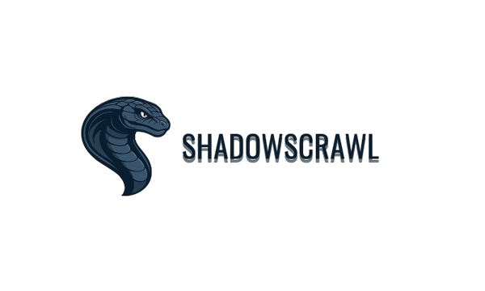

 # ShadowScrawl

<div align="center">
  
  
  <br>
  <strong>🌐 Advanced Dark Web OSINT Tool 🔍</strong>
  <br>
  <em>Scrape, analyze, and visualize the hidden web securely and anonymously</em>
</div>

<p align="center">
  <a href="#features">Features</a> •
  <a href="#installation">Installation</a> •
  <a href="#usage">Usage</a> •
  <a href="#screenshots">Screenshots</a> •
  <a href="#advanced-options">Advanced Options</a> •
  <a href="#security-considerations">Security</a> •
  <a href="#contributing">Contributing</a> •
  <a href="#license">License</a>
</p>

---

## Features

ShadowScrawl is a powerful Python-based tool designed for Dark Web OSINT (Open Source Intelligence) operations, offering:

### Core Features
- 🕸️ **Link Crawling**: Recursive crawling with customizable depth
- 🌐 **Tor Network Integration**: Built-in support for Tor proxies
- 📊 **Results Visualization**: Multiple visualization formats (table, tree, JSON, interactive graph)
- 🔄 **Anonymous Identity Management**: Random identity generation for enhanced privacy
- 📝 **Detailed Reporting**: Comprehensive data output and analysis

### Advanced Capabilities
- 🔍 **Keyword Search**: Find specific terms within crawled content
- 📸 **Screenshot Capture**: Visual documentation of sites
- 🔒 **Security Analysis**: TLS/SSL certificate validation and security header checks
- 📱 **Social Media Detection**: Identify connected social platforms
- 📧 **Contact Information Extraction**: Discover email addresses and communication channels
- 💻 **Technology Stack Detection**: Identify web technologies and frameworks
- 💰 **Cryptocurrency Address Detection**: Locate Bitcoin addresses on sites
- 🧠 **NLP Classification**: AI-powered content categorization

## Installation

### Prerequisites
- Python 3.9 or newer
- Tor Browser or Tor service (for accessing .onion sites)

### Basic Installation
```bash
# Clone the repository
git clone https://github.com/root0emir/ShadowScrawl.git
cd ShadowScrawl

# Create and activate virtual environment
python -m venv shadowscrawl_env
# On Windows
shadowscrawl_env\Scripts\activate
# On Linux/Mac
source shadowscrawl_env/bin/activate

# Install dependencies
pip install -r requirements.txt

# Make sure Tor is running (default: 127.0.0.1:9050)
```

## Usage

### Basic Commands

```bash
# Basic crawl with default settings
python main.py -u http://example.onion

# Crawl without using Tor (for regular websites)
python main.py -u http://example.com --disable-socks5

# Specify crawl depth
python main.py -u http://example.onion --depth 3

# Get basic site information
python main.py -u http://example.onion --info
```

### Advanced Features

```bash
# Search for keywords on pages
python main.py -u http://example.onion --keyword "bitcoin"

# Take screenshots of discovered pages
python main.py -u http://example.onion --screenshot

# Extract and analyze metadata
python main.py -u http://example.onion --metadata

# Perform security analysis
python main.py -u http://example.onion --security

# Save results to database
python main.py -u http://example.onion --save db

# Generate interactive graph
python main.py -u http://example.onion --visualize graph

# Full analysis with all features
python main.py -u http://example.onion --depth 2 --info --metadata --security --screenshot
```

## Advanced Options

```
usage: ShadowScrawl [-h] -u URL [--depth DEPTH] [--host HOST] [--port PORT]
                   [--save {tree,json,db}] [--visualize {table,tree,json,graph}]
                   [-q] [--version] [--update] [--info] [-v] [--disable-socks5]
                   [--random-identity] [--keyword KEYWORD] [--screenshot]
                   [--metadata] [--security] [--retries RETRIES]
                   [--retry-delay RETRY_DELAY]

Gather and analyze data from Tor sites.

options:
  -h, --help            show this help message and exit
  -u URL, --url URL     Specify a website link to crawl
  --depth DEPTH         Specify max depth of crawler (default 1)
  --host HOST           IP address for SOCKS5 proxy (default: 127.0.0.1)
  --port PORT           Port for SOCKS5 proxy (default: 9050)
  --save {tree,json,db} Save results in a file or database
  --visualize {table,tree,json,graph}
                        Visualizes data collection.
  -q, --quiet           Run in quiet mode (no banner)
  --version             Show current version of ShadowScrawl.
  --update              Update ShadowScrawl to the latest stable version
  --info                Displays basic info of the scanned site
  -v                    Verbose logging
  --disable-socks5      Executes HTTP requests without using SOCKS5 proxy
  --random-identity     Use random identity (user agent, etc.) for each request
  --keyword KEYWORD     Search for specific keyword or phrase on crawled pages
  --screenshot          Capture screenshots of crawled pages
  --metadata            Extract and analyze metadata (social media, emails, technologies)
  --security            Perform security analysis (TLS, headers, vulnerabilities)
  --retries RETRIES     Number of retries for failed connections (default: 3)
  --retry-delay RETRY_DELAY
                        Delay between retries in seconds (default: 2.0)
```

## Security Considerations

When using ShadowScrawl, please consider:

- **Legal Compliance**: Only use this tool for legal purposes and authorized investigations.
- **Operational Security**: Run from a secure, isolated environment.
- **Network Isolation**: Consider using a dedicated machine or virtual machine.
- **Traffic Analysis Protection**: Always use Tor when accessing .onion sites.
- **Data Handling**: Be responsible with collected data and follow applicable privacy regulations.

## Contributing

Contributions are welcome! Please feel free to submit a Pull Request.

1. Fork the repository
2. Create your feature branch (`git checkout -b feature/amazing-feature`)
3. Commit your changes (`git commit -m 'Add some amazing feature'`)
4. Push to the branch (`git push origin feature/amazing-feature`)
5. Open a Pull Request

## License

This project is licensed under the MIT License - see the LICENSE file for details.

---

<div align="center">
  <strong>⚠️ DISCLAIMER</strong><br>
  <small>This tool is intended for security research and legitimate OSINT operations only. 
  The authors are not responsible for any misuse or damage caused by this program.</small>
</div>

---

<div align="center">
  Developed by <a href="https://github.com/root0emir">root0emir</a>
</div>
